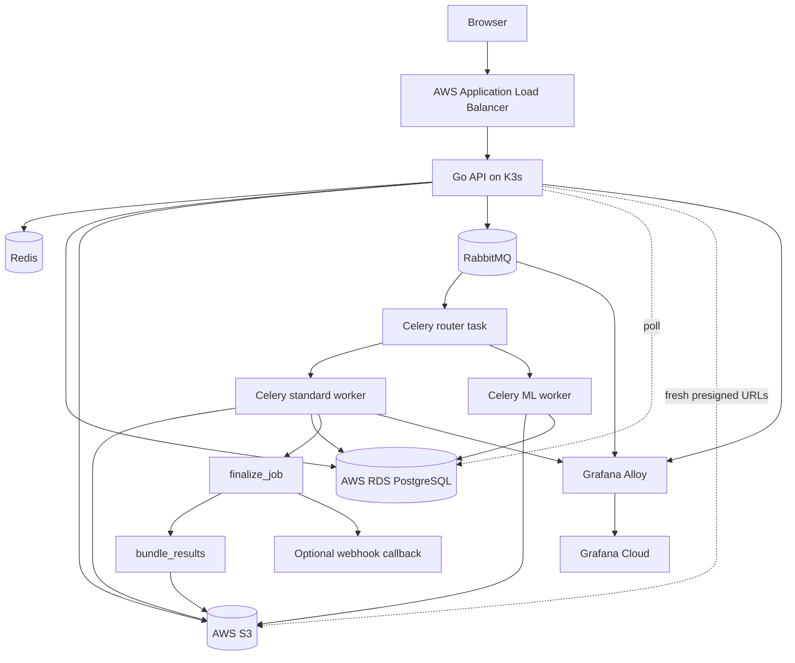
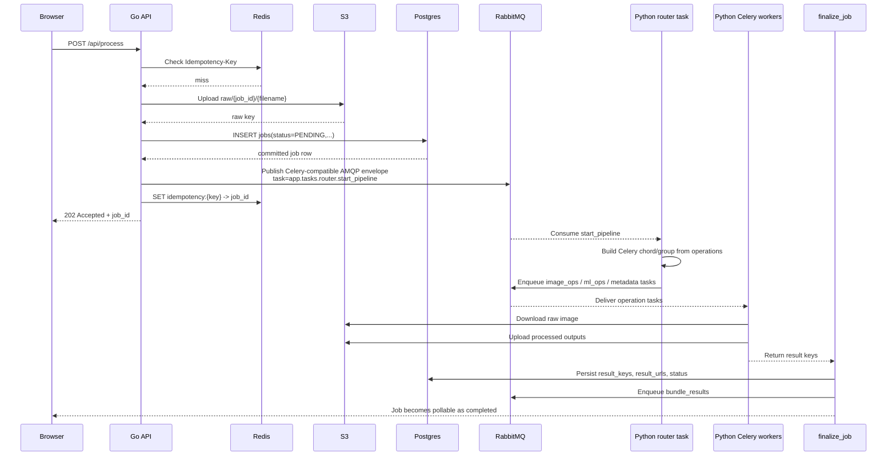

# PixTools


<p align="center">
  
</p>

PixTools is a distributed image-processing system built to demonstrate real cloud and distributed-systems engineering, not just CRUD API work.

It accepts image-processing jobs over HTTP, persists job state in Postgres, publishes asynchronous work to RabbitMQ, executes the pipeline in Python Celery workers, stores artifacts in S3, and exposes a public frontend served by a lightweight Go API.

The current deployed system has been manually verified end-to-end for all supported operations in both single-operation and multi-operation jobs.

## What It Does

PixTools supports these operations:

- `jpg`
- `png`
- `webp`
- `avif`
- `denoise`
- `metadata`

Core behaviors:

- asynchronous job execution via RabbitMQ + Celery
- Redis-backed idempotency keys
- PostgreSQL job tracking on AWS RDS
- raw, processed, and archive artifact storage in S3
- per-job presigned download URLs
- EXIF metadata extraction
- ZIP bundle generation after processing completes
- webhook delivery with circuit-breaker protection
- observability shipped to Grafana Cloud through Alloy

## Current Architecture

PixTools is intentionally split by responsibility:

- `go-api/` owns the public HTTP surface
- `app/` owns the asynchronous worker runtime
- Terraform owns infrastructure state
- Alembic owns database schema state



## Runtime Topology

| Layer | Implementation | Notes |
| --- | --- | --- |
| Public HTTP edge | Go + Gin | Serves frontend, validates requests, uploads raw files, writes job rows, publishes Celery-compatible AMQP messages |
| Async workers | Python 3.12 + Celery | Executes image ops, ML denoise, metadata extraction, finalization, archive bundling, and retention tasks |
| Message broker | RabbitMQ | Durable queueing with dead-letter routing |
| Durable state | PostgreSQL 16 on RDS | Source of truth for job records |
| Idempotency | Redis | Stores `Idempotency-Key -> job_id` mappings |
| Object storage | S3 | Stores raw inputs, processed outputs, and ZIP bundles |
| Orchestration | K3s | Self-hosted Kubernetes control plane on EC2 with role-based node labeling (`k3s-server` infra, `k3s-agent` app) |
| Autoscaling | HPA + KEDA + Cluster Autoscaler | API scales via HPA, worker-standard scales from RabbitMQ queue depth via KEDA, nodes scale via AWS Cluster Autoscaler |
| Stateful storage | AWS EBS CSI + `gp3` StorageClass | RabbitMQ data volume targets `gp3`; StatefulSet storage-class transitions are handled as controlled maintenance |
| Ingress | AWS Load Balancer Controller | Uses AWS ALB and AWS-provided DNS name |
| Telemetry | Alloy DaemonSet -> Grafana Cloud | Logs, metrics, and traces shipped off-cluster from each node |
| Infrastructure | Terraform | VPC, EC2, IAM, RDS, S3, SSM, ECR, security groups |
| Delivery | GitHub Actions + OIDC | CI and CD workflows authenticate to AWS with short-lived credentials |

## Capacity Classes

PixTools now treats cluster capacity as three scheduling classes:

- infra-critical: `rabbitmq`, `redis`, `pixtools-beat`, `celery-exporter`, KEDA, and Cluster Autoscaler stay pinned to `pixtools-workload-infra=true`
- app-standard: `pixtools-api` and `pixtools-worker-standard` stay pinned to `pixtools-workload-app=true` and prefer spreading across app nodes
- app-ml: `pixtools-worker-ml` also stays on app nodes, but with a lower priority class than standard app traffic and a preference to avoid standard workers when spare app capacity exists

ML does not have its own dedicated node class yet. That is an explicit decision, not a missing feature: the current system keeps ML on the shared app pool until observed contention or cost pressure justifies a separate ASG.

## AWS Deployment Shape

The active cloud design is a two-tier K3s deployment in `us-east-1`:

- one stable on-demand infra node for control-plane and stateful cluster services
- one or more spot workload nodes for API and workers
- app nodes are ASG-managed and discovered by Cluster Autoscaler through tags
- RabbitMQ uses a PVC intended for EBS CSI-backed `gp3` storage
- PodDisruptionBudgets protect Redis/RabbitMQ/API during disruption
- PriorityClasses enforce infra-first scheduling during resource pressure
- secrets and runtime config sourced from AWS Systems Manager Parameter Store
- public demo ingress exposed through the AWS ALB DNS name, not a custom domain

This split exists for a reason: control-plane and broker stability do not belong on the same failure domain as bursty image-processing workloads.

## Supported Job Flow

A normal request moves through the system like this:

1. The browser loads `/`, `/static/*`, and `/app-config.js` from the Go API.
2. The frontend validates file type, file size, and same-format conversions before submit.
3. The browser sends `POST /api/process` with multipart form data.
4. The Go API validates the payload, checks Redis idempotency, uploads the raw file to S3, and inserts a `jobs` row into Postgres.
5. The Go API publishes one or more Celery-compatible AMQP messages to RabbitMQ `default_queue`.
6. A Python Celery worker consumes `app.tasks.router.start_pipeline` and expands the requested operations into a Celery chord.
7. Standard image operations run on the standard worker. Denoise runs on the ML worker when queue isolation is enabled.
8. Metadata extraction writes EXIF data back to the job row.
9. `finalize_job` writes terminal result keys and presigned URLs to Postgres.
10. `bundle_results` creates `archives/{job_id}/bundle.zip` asynchronously.
11. The frontend polls `GET /api/jobs/{job_id}` until results and the archive are available.

### Go-to-Python Celery Handoff

This is the most important handoff in the system. The Go API does not try to reimplement Celery Canvas semantics itself. It validates the request, persists the durable job record, and publishes a Celery-compatible AMQP message that the Python worker runtime already understands. The Python router task then expands that lightweight handoff into the full processing DAG.



For the exhaustive workflow, including S3 key patterns, queue semantics, status transitions, and failure branches, see `system_workflow.md`.

## Public API Surface

HTTP surface:

- root/static: `/`, `/static/*`, `/app-config.js`
- metrics: `/metrics`
- API base path: `/api`

| Route | Method | Purpose |
| --- | --- | --- |
| `/metrics` | `GET` | Prometheus scrape endpoint exposed by the Go API |
| `/api/livez` | `GET` | simple liveness probe |
| `/api/readyz` | `GET` | readiness probe for DB, Redis, and RabbitMQ |
| `/api/health` | `GET` | deep health check for DB, Redis, RabbitMQ, and S3 |
| `/api/process` | `POST` | submit a processing job |
| `/api/jobs/:id` | `GET` | poll job status, result URLs, metadata, and archive URL |

### `POST /api/process`

Consumes `multipart/form-data` with these fields:

- `file` required
- `operations` required JSON string array
- `operation_params` optional JSON string object
- `webhook_url` optional absolute `http://` or `https://` URL

Important headers:

- `Idempotency-Key` optional but recommended
- `X-API-Key` required when `API_KEY` is configured
- `X-Request-ID` optional; generated if omitted

Validation rules enforced by the current backend:

- max upload size defaults to `10 MB`
- accepted MIME types:
  - `image/jpeg`
  - `image/png`
  - `image/webp`
  - `image/avif`
- unknown operations are rejected
- empty operation lists are rejected
- same-format conversions are rejected
- `quality` is only accepted for `jpg` and `webp`
- `resize` is only accepted for `jpg`, `png`, `webp`, `avif`, and `denoise`
- webhook URLs must be absolute `http(s)` URLs

Example:

```bash
curl -X POST "http://localhost:8000/api/process" \
  -H "Idempotency-Key: demo-001" \
  -H "X-API-Key: <api-key>" \
  -F "file=@test_image.png;type=image/png" \
  -F "operations=[\"webp\",\"denoise\",\"metadata\"]" \
  -F "operation_params={\"webp\":{\"quality\":80},\"denoise\":{\"resize\":{\"width\":1280}}}"
```

### `GET /api/jobs/:id`

Returns:

- `job_id`
- `status`
- `operations`
- `result_urls`
- `archive_url`
- `metadata`
- `error_message`
- `created_at`

Current runtime statuses:

- `PENDING`
- `PROCESSING`
- `COMPLETED`
- `FAILED`
- `COMPLETED_WEBHOOK_FAILED`

## Current Worker and Queue Design

PixTools uses queue isolation to prevent heavy ML work from starving lightweight image conversions.

Queues:

- `default_queue`
- `ml_inference_queue`
- `dead_letter`

Task routing:

- `app.tasks.router.*` -> `default_queue`
- `app.tasks.image_ops.*` -> `default_queue`
- `app.tasks.metadata.*` -> `default_queue`
- `app.tasks.finalize.*` -> `default_queue`
- `app.tasks.archive.*` -> `default_queue`
- `app.tasks.maintenance.*` -> `default_queue`
- `app.tasks.ml_ops.denoise` -> `ml_inference_queue`

Current workload sizing in Kubernetes:

| Workload | Command / mode | Requests | Limits |
| --- | --- | --- | --- |
| API | Go HTTP server | `20m` CPU / `32Mi` memory | `200m` CPU / `128Mi` memory |
| Standard worker | Celery `default_queue`, `--concurrency=2` | `250m` CPU / `512Mi` memory | `900m` CPU / `1280Mi` memory |
| ML worker | Celery `ml_inference_queue`, solo pool | `500m` CPU / `1024Mi` memory | `1500m` CPU / `2048Mi` memory |
| Beat | Celery Beat | `100m` CPU / `192Mi` memory | `300m` CPU / `384Mi` memory |
| RabbitMQ | StatefulSet | `150m` CPU / `256Mi` memory | `500m` CPU / `512Mi` memory |
| Redis | Deployment | `50m` CPU / `128Mi` memory | `200m` CPU / `256Mi` memory |
| Alloy | DaemonSet | `100m` CPU / `128Mi` memory | `300m` CPU / `384Mi` memory |
| Cluster Autoscaler | Deployment | `50m` CPU / `128Mi` memory | `200m` CPU / `256Mi` memory |

The standard worker was explicitly down-tuned to `--concurrency=2` after live OOM diagnosis on image fan-out workloads. That is not arbitrary tuning; it is the current stable operating point for the demo footprint.

## Storage Layout

Redis key pattern:

- `idempotency:{Idempotency-Key}` -> `<job_id>`

S3 key patterns:

- raw uploads: `raw/{job_id}/{original_filename}`
- processed outputs: `processed/{job_id}/{operation}_{random8}.{ext}`
- ZIP archives: `archives/{job_id}/bundle.zip`

## Observability

PixTools ships telemetry to Grafana Cloud through an in-cluster Alloy DaemonSet.

Current observability stack:

- Alloy for collection and remote write/export
- Grafana Cloud Prometheus for metrics
- Grafana Cloud Loki for logs
- Grafana Cloud Tempo for traces
- Celery Exporter for worker and queue metrics
- OpenTelemetry in the Go API and Python worker runtime

What is currently instrumented:

- Go HTTP request traces
- Celery task traces
- queue wait timing
- worker processing duration
- end-to-end job timing
- task failure and retry counters
- webhook circuit-breaker transitions
- RabbitMQ queue depth gauges
- Go API Prometheus scrape endpoint at `/metrics`

KEDA metrics-adapter auth now requires explicit RBAC delegation and `extension-apiserver-authentication-reader` binding for `keda-metrics-server`. These resources are declared in `k8s/autoscaling/keda-metrics-rbac.yaml` and applied by reconcile before KEDA Helm upgrade.

<p align="center">
  
</p>

<p align="center">
  
</p>

<p align="center">
  
</p>

## CI/CD and Deployment Flow

PixTools uses GitHub Actions for both CI and CD.

Workflows:

- `.github/workflows/ci.yaml`
- `.github/workflows/cd-dev.yaml`
- `.github/workflows/cd-prod.yaml`

### CI

The CI workflow verifies:

- `ruff`
- `mypy`
- `pytest`
- Docker builds
- Trivy image and filesystem scans
- `pip-audit`
- `bandit`

### CD

The deployment flow is intentionally simple and reproducible:

1. build API and worker images
2. push immutable image digests to ECR
3. render Kubernetes manifests from `k8s/`
4. upload rendered artifacts to the manifests S3 bucket
5. resolve the live K3s instance through AWS APIs
6. run `scripts/deploy/reconcile-cluster.sh` over SSM
7. inside reconcile: refresh runtime secrets/config from SSM Parameter Store
8. inside reconcile: clean stale Kubernetes nodes and force-delete stale terminating pods
9. inside reconcile: label nodes by EC2 `Role` tag (`k3s-server` infra / `k3s-agent` app)
10. inside reconcile: install or upgrade AWS EBS CSI and KEDA
11. inside reconcile: apply KEDA metrics RBAC prerequisites before KEDA startup
12. inside reconcile: apply manifests in deterministic order with retry logic and API-server readiness checks
13. inside reconcile: skip immutable RabbitMQ StatefulSet storage-class mutations and require controlled migration script
14. inside reconcile: wait for rollout completion of infra and app workloads
15. run smoke test against the deployed API

Deployment helper scripts:

- `scripts/deploy/render-manifests.sh`
- `scripts/deploy/resolve-k3s-instance.sh`
- `scripts/deploy/run-on-ssm.sh`
- `scripts/deploy/reconcile-cluster.sh`
- `scripts/deploy/migrate-rabbitmq-to-gp3.sh`
- `scripts/deploy/ssm-keda-rbac-check.ps1`

This is not kubectl-clickops. The cluster is reconciled through versioned artifacts and remote automation.

## Infrastructure and Secret Management

Terraform code lives under `infra/` and currently manages:

- networking
- EC2 compute
- ECR repositories
- IAM roles and GitHub OIDC trust
- RDS PostgreSQL
- S3 buckets
- SSM parameters
- security groups
- observability-related AWS plumbing

Secrets are not committed to the repository.

Runtime secrets are sourced from AWS Systems Manager Parameter Store and materialized into Kubernetes secrets/config during reconciliation.

Important files:

- `infra/dev.tfvars`
- `infra/networking.tf`
- `infra/compute.tf`
- `infra/rds.tf`
- `infra/ecr.tf`
- `infra/iam.tf`
- `infra/iam_github.tf`
- `infra/ssm.tf`
- `infra/security_groups.tf`
- `infra/observability.tf`

## Local Development

### Prerequisites

- Docker
- Docker Compose

### Start the stack

```bash
cp .env.example .env
docker compose up -d --build
```

Local services:

- `api`
- `worker-standard`
- `worker-ml`
- `beat`
- `postgres`
- `redis`
- `rabbitmq`
- `localstack`
- `migrate`

Useful local endpoints:

- app: `http://localhost:8000`
- RabbitMQ UI: `http://localhost:15672`

Useful commands:

```bash
docker compose ps
docker compose logs -f api
docker compose logs -f worker-standard
docker compose logs -f worker-ml
docker compose logs -f beat
```

## Benchmarking

Load-testing and performance evidence live under `bench/`.

Scenarios:

- `bench/k6/baseline.js`
- `bench/k6/spike.js`
- `bench/k6/retry_storm.js`
- `bench/k6/starvation_mix.js`

Execution tooling:

- `bench/run-k6.ps1` (single scenario)
- `bench/run-small-stress.ps1` (quick smoke + cluster snapshots)
- `bench/run-sprint5-validation.ps1` (baseline/spike acceptance workflow)
- `bench/run-production-performance-suite.ps1` (in-region temporary runner + full scenario matrix + report)
- `bench/collect-prod-run-logs.ps1` (API/worker/RabbitMQ/KEDA/autoscaler runtime evidence)
- `bench/collect-grafana-metrics.ps1` (PromQL-backed metric extraction)

### Latest in-region production suite snapshot

Run window: 2026-03-04 UTC, region `us-east-1`, environment `dev`, executed from a temporary EC2 runner in-region.

| Scenario | Load profile | Submitted | HTTP failed rate | HTTP p95 | Notable status counts |
| --- | --- | --- | --- | --- | --- |
| baseline | `30 VUs`, `10m` | 3779 | 0.00% | 651.65 ms | `202=3779`, `200=17790` |
| spike | `120 VUs`, `5m` | 6119 | 3.65% | 8538.94 ms | `202=6119`, `500=201`, `0=31` |
| retry_storm | `60 VUs`, `5m`, timeout `8s`, attempts `2` | 6461 | 0.22% | 3618.04 ms | `202=6461`, `500=11`, `0=3` |
| starvation_mix | heavy `8 rps`, light `4 rps`, `8m` | heavy 3768 / light 1877 | 1.33% | 6136.97 ms (light p95: 5469.43 ms) | `202=5645`, `500=76` |

Cross-scenario error taxonomy from that run:

- observed hard failures: `500` (288) and transport-level `0` (34)
- not observed: `409`, `429`, `502`, `503`, `504`

### Sprint 5 readiness result

Latest Sprint 5 readiness run passed baseline and replica-growth checks, but failed overall because automatic node scale-out was not observed under that specific probe shape. This is why node/pod ceilings and queue-pressure behavior remain the main scaling workstream.

### What these benchmarks mean right now

- steady-state behavior is healthy at moderate load
- under burst and mixed heavy/light pressure, API latency and `500` rate degrade
- worker/API replicas frequently hit configured max (`3`), so scale ceilings are a first-order constraint

Benchmark pass/fail gates remain tracked in `bench/README.md` and `docs/scaling_guardrails.md`.

## Reference Docs

These files are the detailed source-of-truth documents for the current system:

- `system_workflow.md` - exact runtime workflow, queue handoff, S3 keys, status semantics, and failure branches
- `go_api_parity_patchlist.md` - migration parity checklist from the Python API to the Go API
- `predeploy_blockers.md` - deploy review notes and intentional design debt
- `bench/README.md` - benchmark execution notes
- `bench/run-production-performance-suite.ps1` - full in-region production-style benchmark orchestrator
- `bench/collect-prod-run-logs.ps1` - runtime log capture after benchmark windows
- `docs/scaling_guardrails.md` - dashboard panel queries, alert conditions, and benchmark gates
- `docs/runbooks/` - incident runbooks for backlog, scale-out failure, OOM recurrence, and spot interruption
- `infra/README.md` - Terraform-specific notes

Generated benchmark artifacts are written under `bench/results/` (gitignored) so each run keeps full raw evidence and summaries without polluting source control.

## Repository Layout

```text
app/
  services/        Shared Python services: S3, webhook, DAG builder, idempotency
  tasks/           Celery tasks, routing, finalization, archive, maintenance
  ml/              DnCNN model definition
  observability.py Worker/API observability wiring
  middleware.py    Legacy FastAPI middleware still used by Python runtime pieces
  metrics.py       Prometheus metric definitions used by workers
  main.py          Legacy FastAPI entrypoint retained as reference

go-api/
  cmd/api/         Go entrypoint
  internal/config/ Runtime config loading
  internal/handlers/ HTTP handlers and middleware
  internal/models/ Validation and GORM models
  internal/services/ S3, Redis idempotency, AMQP Celery publisher
  internal/telemetry/ OpenTelemetry setup
  static/          Public frontend assets served by the Go API

alembic/           Database schema migrations
bench/             k6 scenarios and benchmark collection helpers
docs/              scaling guardrails and runbooks
infra/             Terraform IaC
k8s/               Kubernetes manifests
  autoscaling/     Cluster Autoscaler, KEDA values/scaled objects, KEDA metrics RBAC
  storage/         EBS CSI Helm values and gp3 storage class
scripts/deploy/    Deployment and reconciliation helpers
  migrate-rabbitmq-to-gp3.sh  Controlled RabbitMQ PVC migration helper
scripts/teardown/  Full AWS teardown tooling
tests/             Python tests
images/            README screenshots
```

## Troubleshooting

### Job stuck in `PENDING` or `PROCESSING`

Check:

```bash
kubectl -n pixtools get pods
kubectl -n pixtools logs deploy/pixtools-worker-standard --tail=200
kubectl -n pixtools logs deploy/pixtools-worker-ml --tail=200
```

### Health check failing

Check:

```bash
curl http://<host>/api/health
```

### Deployment rollout failing

Inspect:

```bash
kubectl -n pixtools get pods -o wide
kubectl -n pixtools describe pod <pod-name>
```

### Full environment teardown

```powershell
powershell -ExecutionPolicy Bypass -File .\scripts\teardown\teardown-aws.ps1 -Environment dev -AutoApprove
```

## Known Limitations

- Current autoscaling ceilings (`pixtools-api` max `3`, `pixtools-worker-standard` max `3`) are intentionally conservative and become the bottleneck under aggressive spike/retry profiles.
- RabbitMQ StatefulSet storage-class spec is immutable; storage-class migration requires controlled maintenance via `scripts/deploy/migrate-rabbitmq-to-gp3.sh` instead of normal `kubectl apply`.
- Retry-storm and mixed heavy/light scenarios still produce `500` responses and transport-level timeouts before any `429` admission/backpressure policy is applied.
- The public demo uses the AWS ALB DNS name instead of a custom domain.
- Security is intentionally demo-grade at the frontend edge because the UI is public and the API key is shipped through `/app-config.js`.
- There is no transactional outbox yet; enqueue failures are compensated by marking the job failed.

## Engineering Notes

The interesting work in PixTools was not writing an image conversion endpoint. It was making the whole platform behave coherently under real cloud constraints:

- splitting control-plane and workload capacity so spot churn does not take the cluster brain down with it
- keeping Alembic as the schema authority while migrating only the HTTP edge from Python to Go
- publishing Celery-compatible AMQP messages directly from Go instead of pretending the Python worker runtime does not matter
- diagnosing live worker failures from actual Kubernetes and SSM evidence instead of hand-waving them as transient
- treating deployment and teardown as first-class automation problems, not manual ops checklists

That is the point of the project.

## License

Internal portfolio project.
